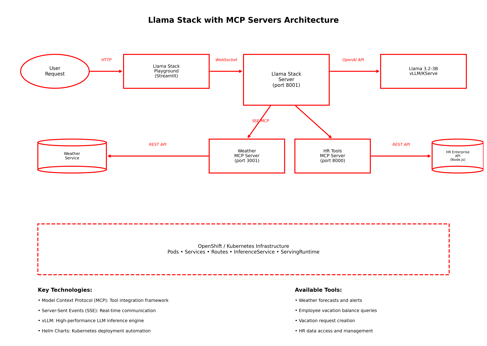
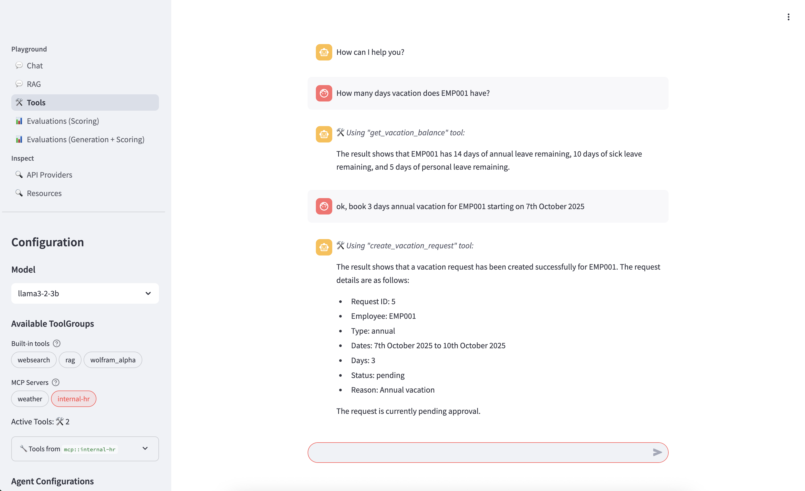

# Llama Stack with MCP Server

Welcome to the Llama Stack with MCP Server Kickstart!

Use this to quickly deploy Llama 3.2-3B on vLLM with Llama Stack and MCP servers in your OpenShift AI environment.

To see how it's done, jump straight to [installation](#install).

## Table of Contents

1. [Description](#description)
2. [Architecture diagrams](#architecture-diagrams)
3. [References](#references)
4. [Prerequisites](#prerequisites)
   - [Minimum hardware requirements](#minimum-hardware-requirements)
   - [Required software](#required-software)
   - [Required permissions](#required-permissions)
5. [Install](#install)
   - [Clone the repository](#clone-the-repository)
   - [Create the project](#create-the-project)
   - [Single Command Installation (Recommended)](#single-command-installation-recommended)
6. [Test](#test)
   - [Test HR API MCP Server in Playground](#test-hr-api-mcp-server-in-playground)
   - [Verification](#verification)
7. [Cleanup](#cleanup)

## Description

This kickstart provides a complete setup for deploying:
- Llama 3.2-3B model using vLLM on OpenShift AI
- Llama Stack for agent-based interactions
- Sample HR application providing restful services to HR data e.g. vacation booking
- MCP Weather Server for real-time weather data access
- Custom MCP server providing access to the sample HR application


It's designed for environments where you want to:
- Serve Llama 3.2-3B efficiently using vLLM
- Enable LLMs to interact with external tools through Llama Stack
- Demonstrate real-world tool integration using the MCP HR server


## Architecture diagrams



## References

- [Llama Stack Documentation](https://rh-aiservices-bu.github.io/llama-stack-tutorial/)
- [Model Context Protocol (MCP) Quick Start](https://modelcontextprotocol.io/quickstart/server)
- [vLLM Documentation](https://github.com/vllm-project/vllm)
- [Red Hat OpenShift AI Documentation](https://access.redhat.com/documentation/en-us/red_hat_openshift_ai)


## Prerequisites

### Minimum hardware requirements

- 1 GPU required (NVIDIA L40, A10, or similar)
- 8+ vCPUs
- 24+ GiB RAM
- Storage: 30Gi minimum in PVC (larger models may require more)

### Required software

- Red Hat OpenShift
- Red Hat OpenShift AI 2.16+
- OpenShift CLI (`oc`) - [Download here](https://docs.openshift.com/container-platform/latest/cli_reference/openshift_cli/getting-started-cli.html)
- Helm CLI (`helm`) - [Download here](https://helm.sh/docs/intro/install/)


### Required permissions

- Standard user. No elevated cluster permissions required

## Install

**Please note before you start**

This example was tested on Red Hat OpenShift 4.17.30 & Red Hat OpenShift AI v2.19.0.

All components are deployed using Helm charts located in the `helm/` directory:
- `helm/llama3.2-3b/` - Llama 3.2-3B model on vLLM
- `helm/llama-stack/` - Llama Stack server
- `helm/mcp-weather/` - Weather MCP server
- `helm/llama-stack-playground/` - Playground UI
- `helm/custom-mcp-server/` - Custom HR API MCP server
- `helm/hr-api/` - HR Enterprise API
- `helm/llama-stack-mcp/` - Umbrella chart for single-command deployment

### Clone the repository

```bash
git clone https://github.com/rh-ai-kickstart/llama-stack-mcp-server.git && \
    cd llama-stack-mcp-server/
```

### Create the project

```bash
oc new-project llama-stack-mcp-demo
```

### Build and deploy the helm chart

Deploy the complete Llama Stack with MCP servers using the umbrella chart:

```bash

# Build dependencies (downloads and packages all required charts)
helm dependency build ./helm/llama-stack-mcp

# Deploy everything with a single command
helm install llama-stack-mcp ./helm/llama-stack-mcp 
```

**Note:** The `llama-stack` pod will be in `CrashLoopBackOff` status until the Llama model is fully loaded and being served. This is normal behavior as the Llama Stack server requires the model endpoint to be available before it can start successfully.

This will deploy all components including:
- Llama 3.2-3B model on vLLM
- Llama Stack server with automatic configuration
- MCP Weather Server
- HR Enterprise API  
- HR MCP Server
- Llama Stack Playground

Once the deployment is complete, you should see:

```bash
To get the playground URL:
  export PLAYGROUND_URL=$(oc get route llama-stack-playground -o jsonpath='{.spec.host}' 2>/dev/null || echo "Route not found")
  echo "Playground: https://$PLAYGROUND_URL"

To check the status of all components:
  helm status {{ .Release.Name }}
  oc get pods -l app.kubernetes.io/part-of=llama-stack-mcp

For troubleshooting:
  oc get pods
  oc logs -l app.kubernetes.io/name=llama-stack
  oc logs -l app.kubernetes.io/name=llama3-2-3b


Enjoy Llama Stack and MCP on OpenShift AI! 
```

## Test

1. Get the Llama Stack playground route:
```bash
oc get route llama-stack-playground -n llama-stack-mcp-demo
```

2. Open the playground URL in your browser (it will look something like `https://llama-stack-playground-llama-stack-mcp-demo.apps.openshift-cluster.company.com`)


3. In the playground:
   - Click on the "Tools" tab
   - Select "Weather" MCP Server from the available tools
   - In the chat interface, type: "What's the weather in New York?"

4. You should receive a response similar to:
```
🛠 Using "getforecast" tool:

The current weather in New York is mostly sunny with a temperature of 75°F and a gentle breeze coming from the southwest at 7 mph. There is a chance of showers and thunderstorms this afternoon. Tonight, the temperature will drop to 66°F with a wind coming from the west at 9 mph. The forecast for the rest of the week is mostly sunny with temperatures ranging from 69°F to 85°F. There is a slight chance of showers and thunderstorms on Thursday and Friday nights.
```

This confirms that the Llama Stack is successfully communicating with the MCP Weather Server and can process weather-related queries.

2. **Test HR API MCP server tools**:

In the playground interface:

- **Navigate to Tools**: Click on the "Tools" tab
- **Verify availability**: Look for your Internal HR tools:
  - `get_vacation_balance` - Check employee vacation balances
  - `create_vacation_request` - Submit new vacation requests

Select the "internal-hr" MCP Server

3. **Test with sample queries**:

**Test vacation balance:**
```
What is the vacation balance for employee EMP001?
```

**Test vacation request:**
```
book some annual vacation time off for EMP001 for June 8th and 9th
```



### Verification

Verify that your custom MCP server is working correctly:

```bash
# Check all pods are running
oc get pods

# Check the custom MCP server logs
oc logs -l app=custom-mcp-server

# Test the service connectivity
oc exec -it deployment/llama-stack -- curl http://custom-mcp-server:8000/health

# Get the route URL for external access
ROUTE_URL=$(oc get route custom-mcp-server -o jsonpath='{.spec.host}')
echo "Custom MCP Server URL: https://${ROUTE_URL}"
```

## Cleanup

To remove all components from OpenShift:

### Option 1: Remove umbrella chart (if using single command installation)
```bash
# Remove the complete deployment
helm uninstall llama-stack-mcp
```


### Option 2: Delete the entire project
```bash
# Delete the project and all its resources
oc delete project llama-stack-mcp-demo
```

This will remove:
- Llama 3.2-3B vLLM deployment
- Llama Stack services and playground
- MCP Weather Server
- Custom MCP Server (if deployed)
- HR Enterprise API (if deployed)
- All associated ConfigMaps, Services, Routes, and Secrets